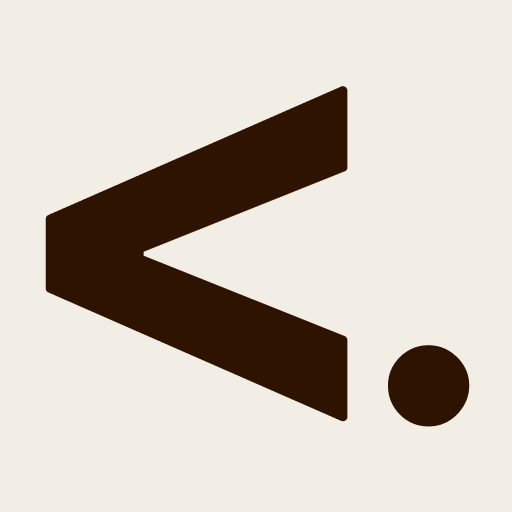

<div align="center">
  <a href="https://ps-lang.dev">
    
  </a>

  <h1>PS-LANG™</h1>

  <p><strong>Privacy-First Scripting Language for Multi-Agent Context Control</strong></p>

  <p>Control what AI agents see in your workflows.</p>

  <p>
    <a href="https://www.npmjs.com/package/ps-lang"></a>
    <a href="./LICENSE"></a>
    <a href="https://github.com/ps-lang/ps-lang"></a>
  </p>

  <p>
    <strong>Version:</strong> 0.2.3-alpha.1 &nbsp;|&nbsp; <strong>Status:</strong> v0.2 Spec Released — Parser Coming Soon
  </p>

  <p>
    <a href="https://ps-lang.dev"><strong>→ ps-lang.dev ←</strong></a>
  </p>
</div>

<br/>

---

## 🎉 New in v0.2.3-alpha.1

**Specification Released!** PS-LANG v0.2 introduces powerful new syntax features:

- ✅ **Privacy-first default** - `<. lazy close` (no closing tag needed)
- ✅ **Directional context** - `<-.` (backward), `<--.` (further back), `.->` (forward)
- ✅ **Named zones** - `<.auth:description .>` for selector-based chaining
- ✅ **Auto-boundary detection** - Parser intelligently closes zones
- ⏳ **Parser implementation** - Coming in v0.2.1-alpha.2 (v0.1 fully supported)

**Read the spec:**
- [Full Specification](./docs/SYNTAX-V2.md)
- [Quick Reference](./docs/SYNTAX-V2-QUICK-REF.md)
- [v1 vs v2 Comparison](./docs/V1-VS-V2-COMPARISON.md)
- [Working Example](./examples/v2-multi-agent-workflow.psl)

---

## What is PS-LANG?

**PS-LANG** is an open source framework with zone-based syntax for controlling what AI agents see in multi-agent workflows. **PS Journaling™** is what you create with it—your own journal instance for tracking AI collaborations. Think of PS-LANG as the pen, and PS Journaling™ as your digital journal.

Use **zones** to mark content as private, pass-through, or active workspace.

**Designed to evolve with you:**
- Override and extend the syntax for your needs
- Platform/agent/model agnostic approach
- Works with Claude, GPT, Cursor, Copilot, and custom agents
- Community-driven development

**Perfect for:**
- Multi-agent pipelines (Research → Writing → Review)
- Context engineering (control what each agent sees)
- Benchmarking (clean test environments)
- Privacy-first AI collaboration

---

## Why Start Using PS-LANG Now

**You don't even need to install it.**

As someone who writes prompts daily (Claude Code, Cursor, ChatGPT, etc.), PS-LANG just adds structure:

```javascript
// Before: Unstructured prompt
// "Hey Claude, build auth. Don't show the next agent my messy notes about passwords."

// After: Structured with PS-LANG
<@. Build JWT authentication .@>
<. Private: passwords are hashed with bcrypt, 10 rounds .>
<#. Next agent: uses bcrypt for hashing, 15min token expiry .#>
```

**Two ways to use it:**
1. **Write directly in prompts** - Add `<.>` zones as you write
2. **Use a preprocessor** - Convert raw prompts to `.psl` files with PS-LANG context for benchmarking and RL workflows

**What this gives you:**
- **Context control** - Decide what each agent sees
- **Cleaner handoffs** - Next agent gets only what they need
- **Better logs** - Your work becomes structured, searchable
- **Future-proof** - Syntax works today, unlocks encryption later

**No installation, no setup, no friction.** Just write `<.>` in your next prompt.

When you're ready for CLI tools, themes, and templates → install below.

---

## Use PS-LANG Right Now

### Single Line (In Prompts)

Start using zones in your everyday prompts. **Lazy closing works** - you don't need to match tags:

```markdown
<. Private note: trying a new approach >
<#. Context for next agent: using JWT auth >
<@. Current task: fix the login bug >
<?. Should we add 2FA? >
<.bm target: 50ms response time .bm>

# All of these are valid:
<. text .>    # Match closing
<. text .>    # Universal close
<. text >     # Lazy close (space + >)
```

#### Multiline (In Documents)

Use nested zones for complex workflows:

```markdown
# Authentication System

<@. Active: Building JWT authentication
  <#. For next agent: This uses bcrypt for hashing .#>
  <. Private: Still unsure about refresh token strategy .>
  <.bm current_performance
    login: 45ms
    token_gen: 12ms
  .bm>
.@>

<#. API Endpoints:
- POST /login
- POST /refresh
- GET /user
.#>
```

---

## Quick Start (Install CLI)

Ready for CLI tools, themes, and templates?

```bash
npx ps-lang@alpha init
```

This creates a `.ps-lang/` folder in your project with:
- Configuration files
- PS-LANG syntax templates and examples
- Example zone-enriched commands (optional)
- Schema for validation

**Commands:**
```bash
npx ps-lang zones       # Show zone reference
npx ps-lang example     # Generate templates
npx ps-lang extract     # Visualize zones in files
npx ps-lang stats       # Project analytics
npx ps-lang theme list  # VS Code themes
```

---

## Zone Syntax (Infinitely Extensible)

**PS-LANG zones are patterns, not limits.** Create any zone that makes sense for your workflow.

### Recommended Zones (Get Started)

These 7 zones cover most use cases, but you can invent your own:

```markdown
<. Current agent only note .>
<#. Pass-through info for next agent .#>
<@. Active workspace .@>
<~. AI-generated metadata .~>
<$. Business/monetization context .$>
<?. Question for later .?>
<.bm metric: value .bm>
```

### Block Usage (Multiline)

```markdown
<.
Current agent only:
- Note 1
- Note 2
.>

<#.
For next agent:
- Context item 1
- Context item 2
.#>

<@.
Active workspace:
- Current task
- Work in progress
.@>

<.bm performance
load_time: 45ms
memory: 128mb
.bm>
```

### Recommended Zones Reference

| Zone | Syntax | Purpose |
|------|--------|---------|
| **Current Agent Only** | `<. text .>` | Only current agent sees |
| **Pass-Through** | `<#. text .#>` | Documentation for next agent |
| **Active Workspace** | `<@. text .@>` | Current agent's work area |
| **AI-Managed** | `<~. text .~>` | AI-generated metadata |
| **Business/Monetization** | `<$. text .$>` | Business strategy, pricing, revenue |
| **Questions** | `<?. text .?>` | Open questions |
| **Benchmark** | `<.bm text .bm>` | Metrics or references |

### Invent Your Own

**The pattern:** `<symbol. content .symbol>`

Examples discovered by users:
```markdown
<-. review this later .->
<:note note content :note>
<:blog blog idea :blog>
<abc. custom zone abc.>
</!. urgent flag !.>
```

**You define the meaning.** PS-LANG is a convention you control.

### Flexible Closing Syntax

**You don't need to match closing tags exactly.** These all work:

```markdown
<. private note .>          # Traditional: symmetrical
<. private note .>          # Universal close: just .>
<. private note >           # Minimal: just >
<#. context .#>             # Symmetrical: <#. mirrors to .#>
<#. context .>              # Universal close
<#. context >               # Minimal close
```

**Rule:** As long as there's a space before the closing `>`, PS-LANG recognizes it.

**Why?** Flexibility. Write what feels natural. The opening tag defines the zone type.

**Full reference:** `.ps-lang/examples/basic-zones.md`

---

## Real-World Example

```markdown
<@. Active: Building user authentication .@>

## Authentication Flow

<#.
Next agent needs this context:
- Using JWT tokens
- 15-minute expiry
- Refresh token pattern
.#>

<.
Current agent only: Consider adding 2FA later
Other agents won't see this note
.>

<.bm auth-performance
Login time: 45ms
Token generation: 12ms
.bm>
```

---

## Project Structure

After `npx ps-lang init`:

```
your-project/
├── .ps-lang/
│   ├── config/
│   │   ├── ps-lang.config.json      # Settings
│   │   └── claude-commands.json     # Custom commands
│   ├── templates/
│   │   ├── journal-template.psl
│   │   └── log-template.psl
│   ├── schemas/
│   │   └── psl-schema.json
│   ├── examples/
│   │   └── basic-zones.md           # Quick reference
│   └── README.md
└── .gitignore                        # Updated automatically
```

---

## Commands

```bash
# Initialize in your project
npx ps-lang init

# Show zone syntax quick reference
npx ps-lang zones

# Generate example files
npx ps-lang example handoff     # Agent handoff document
npx ps-lang example benchmark   # Performance benchmarks
npx ps-lang example journal     # Daily journal entry
npx ps-lang example component   # React component with zones

# Extract zones from files (see what agents would see)
npx ps-lang extract README.md

# Show project zone statistics
npx ps-lang stats

# Manage VS Code themes
npx ps-lang theme list                # List available themes
npx ps-lang theme set journal         # Apply Journal theme (default)
npx ps-lang theme set dark-agent      # Apply Dark Agent theme
npx ps-lang theme set minimal-light   # Apply Minimal Light theme
npx ps-lang theme set zone-focused    # Apply Zone Focused theme
npx ps-lang theme set disable         # Remove theme customizations

# Validate syntax (basic)
npx ps-lang check

# Show help
npx ps-lang help

# Show version
npx ps-lang version
```

---

## VS Code Themes

PS-LANG includes 4 custom VS Code themes optimized for journaling and multi-agent development:

### Available Themes

1. **PS-LANG Journal** (default) - Warm, paper-like theme perfect for journaling and documentation
2. **PS-LANG Dark Agent** - Dark theme optimized for multi-agent development workflows
3. **PS-LANG Minimal Light** - Clean, minimal light theme for focused work
4. **PS-LANG Zone Focused** - High contrast theme with zone-aware color coding

### Using Themes

During `npx ps-lang init`, you'll be prompted to choose a theme. Or manage themes anytime:

```bash
# List all themes
npx ps-lang theme list

# Apply a theme
npx ps-lang theme set journal

# Disable PS-LANG themes
npx ps-lang theme set disable
```

**Note:** Themes are applied to your `.vscode/settings.json` and can be overridden or removed anytime. They don't affect other projects.

---

## Installation Options

**One-time use (recommended for testing):**
```bash
npx ps-lang init
```

**Global installation:**
```bash
npm install -g ps-lang@alpha
ps-lang init
```

**Add to project:**
```bash
npm install ps-lang@alpha
```

---

## Alpha Testing Goals

We need your help testing:

1. **Zone Syntax**
   - Is the syntax clear and intuitive?
   - Are 7 zones enough?
   - Any parsing issues?

2. **`.ps-lang` Folder Structure**
   - Is it intuitive?
   - Are files in the right places?
   - What's missing?

3. **Zone Syntax**
   - Are 7 zones enough?
   - Is `<.bm>` dual-purpose confusing?
   - Syntax improvements?

4. **Real-World Usage**
   - Does it solve your problems?
   - Performance impact?
   - Integration friction?

---

## Feedback

**We want to hear from you!**

- **Issues:** https://github.com/vummo/ps-lang/issues
- **Email:** hello@ps-lang.dev
- **Discord:** Coming soon
- **Docs:** https://ps-lang.dev

**What to report:**
- ✅ What works well
- ❌ What's confusing
- 💡 Feature ideas
- 🐛 Bugs
- 📊 Performance data

---

## FAQ

### Q: Does this slow down my workflow?

No! Add zones only where context control matters. Most files don't need any zones.

### Q: What if I use a different AI tool?

PS-LANG works with any AI tool. The syntax is platform-agnostic.

### Q: Can I use this in production?

It's alpha software. Use in side projects first, production when stable.

### Q: How do I uninstall?

```bash
rm -rf .ps-lang
# Remove from .gitignore if desired
```


---

## Roadmap

**Alpha** - Basic zone syntax, CLI tools, themes

**Beta** - `.psl` file format, secrets management

**v1.0** - Parser library, multi-agent framework integration, ChatGPT support

---

## Privacy & Data Retention (Alpha)

PS-LANG offers three data retention tiers that give users full control:

- 🔒 **Privacy First** (Default): 30 days, no AI training
- ⚖️ **Standard**: 2 years, anonymized insights only
- 🚀 **Research Contributor**: 5 years, full AI training with benefits

**Current Alpha Status:**
- ✅ User tier selection UI (live in v0.2.3)
- ✅ Preference storage and management
- 🚧 Automated enforcement coming in Beta

See **[Privacy Roadmap](./docs/PRIVACY-ROADMAP.md)** for full implementation status and timeline.

**Your Privacy Rights:**
- Choose your retention tier in [Account Settings](https://ps-lang.dev/settings)
- [Export your data](https://ps-lang.dev/api/privacy/export-data) anytime
- Request deletion: privacy@ps-lang.dev
- Read our [Privacy Policy](https://ps-lang.dev/privacy)

---

## Contributing

We welcome contributions across all areas:

- **Syntax & Zones**: New zone proposals, syntax improvements
- **Privacy Infrastructure**: Help build automated enforcement ([see roadmap](./docs/PRIVACY-ROADMAP.md))
- **Documentation**: Real-world use cases, tutorials, examples
- **Testing**: GDPR/CCPA compliance verification

**Get Involved:**
- GitHub Issues: https://github.com/ps-lang/ps-lang/issues
- Discussions: https://github.com/ps-lang/ps-lang/discussions
- Email: hello@ps-lang.dev

---

## License

MIT - See [LICENSE](./LICENSE)

---

**PS-LANG™ v0.2.3-alpha.1** · PS-LANG is a trademark of Vummo Labs
